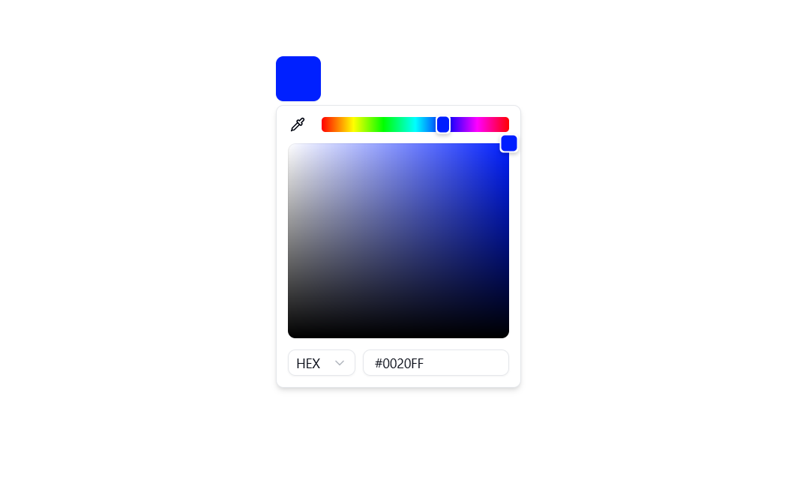

# Color Picker Component

A modern, customizable color picker component built with React, Next.js, and Tailwind CSS. This component provides an intuitive interface for selecting colors with support for various color formats.

## Features

- 🎨 Interactive color picker with visual feedback
- 📱 Responsive design
- 🎯 Multiple color format support
- 🎭 Customizable appearance
- ⚡ Built with Next.js and React
- 🎨 Styled with Tailwind CSS

## Installation

1. First, install shadcn/ui components:

```bash
# Install shadcn/ui CLI
npx shadcn-ui@latest init

# Install required components
npx shadcn-ui@latest add popover
npx shadcn-ui@latest add select
```

2. Install additional dependencies:

```bash
npm install react-colorful
```

3. Copy the component files to your project:

```bash
# Create a components directory if you don't have one
mkdir -p src/components

# Copy the color picker component files
cp -r src/components/color-picker/* your-project/src/components/
```

## Usage

Here's a basic example of how to use the color picker component:

```tsx
import { ColorPicker } from "@/components/color-picker";

export default function YourComponent() {
  return (
    <div>
      <ColorPicker
        value="#ff0000"
        onChange={(color) => console.log("Selected color:", color)}
      />
    </div>
  );
}
```

### Props

| Prop      | Type                    | Description                          | Default   |
| --------- | ----------------------- | ------------------------------------ | --------- |
| value     | string                  | The current color value (hex format) | '#000000' |
| onChange  | (color: string) => void | Callback when color changes          | -         |
| className | string                  | Additional CSS classes               | -         |

## Customization

You can customize the appearance of the color picker by overriding the default styles. Here's an example of how to customize the component:

```css
/* Add these styles to your CSS file */
.your-component .react-colorful {
  height: 240px;
}

.your-component .react-colorful__saturation {
  border-radius: 4px 4px 0 0;
}

.your-component .react-colorful__hue {
  height: 40px;
  border-radius: 0 0 4px 4px;
}

.your-component .react-colorful__hue-pointer {
  width: 12px;
  height: inherit;
  border-radius: 0;
}
```

For more customization options and examples, visit the [react-colorful documentation](https://www.npmjs.com/package/react-colorful#customization).

## Preview



## Development

To run the project locally:

```bash
# Install dependencies
npm install

# Start development server
npm run dev
```

The development server will start at `http://localhost:3000`

## Building for Production

```bash
# Build the project
npm run build

# Start production server
npm start
```

## License

MIT License - feel free to use this component in your projects!

## Contributing

Contributions are welcome! Please feel free to submit a Pull Request.
